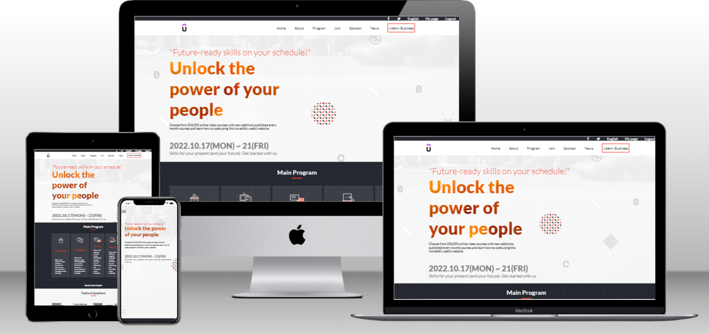

# Project Name

> HTML-CSS-JavaScript-capstone-project1

## Built With

- Html
- Css
- Javascript
- Flexbox
- Grid

## 🚀 Live Demo 

Click here to see the [Live Demo](https://soesandarwin2201.github.io/soesandarwin.github.io/) of the website 

## Getting Started

**This project is build for capstone project from microverse, I used my own content for this and design inspired by Cindy Shin in Behance..**

To get a local copy up and running follow these simple example steps.

### Prerequisites
- PC with the Internet

## Authors

👤 **Soe Sandar Win**

- GitHub: [@soesandarwin2201](https://github.com/soesandarwin2201)
- LinkedIn: [@soesandarwin](https://www.linkedin.com/in/soe-sandar-win-softwareengineer/)

## 🤝 Contributing

Contributions, issues, and feature requests are welcome!

Feel free to check the [issues page](https://github.com/soesandarwin2201/HTML-CSS-JavaScript-capstone-project1/issues).

## Show your support

Give a ⭐️ if you like this project!

## Acknowledgments

- Cindy Shin the author of the origin Design [https://www.behance.net/adagio07]

## 📝 License

This project is [MIT](./LICENSE) licensed.

## My Project documentation

- [https://www.loom.com/share/ae76a7aa331749a18a74d69ea7250161]
